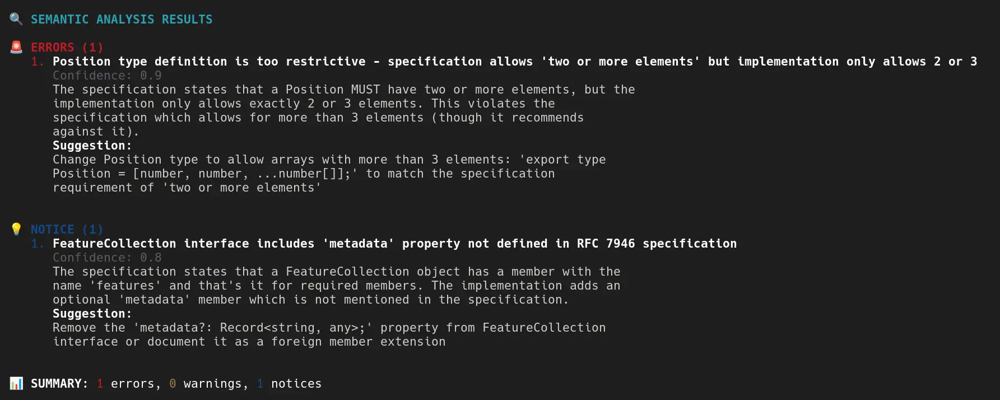

# Semcheck

Semcheck is a tool that uses large language models to verify that your implementation matches your specification. Define semantic rules to describe how your code should align with your specification, then let Semcheck handle the comparison. Use it as a final check before committing or merging code.

## Features

* Non-intrusive: no changes required to existing code or specification files
* Bring Your Own Model: supports OpenAI, Anthropic, Gemini, Cerebras and Ollama (local)
* Supports remote specification files (e.g., `https://www.rfc-editor.org/rfc/rfc7946.txt`)
* Easy setup with `semcheck -init`

## Example Output



## Installation

### Prerequisites

* [Go](https://go.dev/doc/install) 1.24 or newer
* [golangci-lint](https://golangci-lint.run): (optional, for development)
* [Just](https://github.com/casey/just) (optional, for development)

### Install

```bash
go install github.com/rejot-dev/semcheck@latest
```

## Configuration

Semcheck requires a configuration file. Generate one interactively using the `-init` flag:

```bash
semcheck -init
```

This command creates a `semcheck.yaml` file. Edit this file to suit your project.

Example configuration:

```yaml
version: "1.0"
provider: openai  # Options: openai, anthropic, gemini, ollama, cerebras
model: gpt-4.1
api_key: ${OPENAI_API_KEY}
timeout: 30
fail_on_issues: true

rules:
  - name: function-spec-compliance
    description: Check if functions match their specifications
    enabled: true
    files:
      include:
        - "**/*.go"
      exclude:
        - "*_test.go"
    specs:
      - path: "docs/api.md"
      # Remote specs are supported
      - path: "https://example.com/spec.md"
    fail_on: "error"
```

## Usage

### Basic Usage

```bash
# Create a config file
semcheck -init

# Check all spec/implementation rules
semcheck

# Pass specific files that need checking,
# semcheck uses the rules to determine which comparisons need to be made
semcheck spec.md

# Both implementation and specification files can be passed
semcheck impl.go

# Run on staged files (pre-commit)
semcheck -pre-commit

# Use a custom config file
semcheck -config my-config.yaml file1.go

# You can also use double dash syntax for flags
semcheck --config my-config.yaml

# Show help
semcheck -help
```

### Defining Rules

Define rules that link specification files to implementation files. Semcheck runs the LLM once per rule, and in pre-commit mode, only for rules with modified files. For best results, try to keep the number of files per rule small, LLMs perform best with focused context.

Example rules:

```yaml
rules:
  - name: "config-spec"
    enabled: true
    files:
      include:
        - "./internal/config/*.go"
      exclude:
        - "*_test.go"
    specs:
      - path: "config-spec.md"

  - name: "geojson"
    description: "Ensure GeoJSON implementation matches RFC 7946"
    enabled: true
    files:
      include:
        - "packages/geojson/src/*.ts"
      exclude:
        - "*.test.ts"
    specs:
      - path: "https://www.rfc-editor.org/rfc/rfc7946.txt"
    prompt: |
      Our GeoJSON implementation is incomplete; only check implemented features.
```

### Development

A [Justfile](./Justfile) is included for common development tasks.

```bash
# List available commands
just
```

### Running Tests

```bash
just test
just test-coverage
```

### Checking Semcheck with Semcheck

Semcheck uses itself to check that it has correctly implemented it's [own specification](./specs/semcheck.md). Run Semcheck without arguments to check that is has been correctly implemented.

```bash
semcheck
```

## Ideal Outcome


