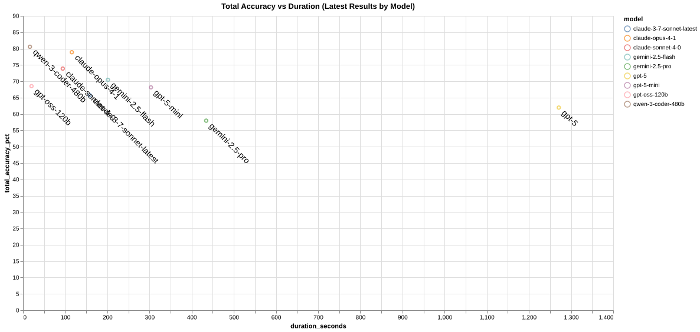

# Semcheck

Semcheck is a tool that uses large language models to verify that your implementation matches your specification. Link specifications directly to your code using inline comments, or define semantic rules to describe how your code should align with your specification. Use it as a final check before committing or merging code.

## Features

* Non-intrusive: no changes required to existing code or specification files
* Bring Your Own Model: supports OpenAI, Anthropic, Gemini, Cerebras and Ollama (local)
* Supports remote specification files (e.g., `https://www.rfc-editor.org/rfc/rfc7946.txt`)
* Easy setup with `semcheck -init`

## Example Output


## Installation

### Prerequisites

* [Go](https://go.dev/doc/install) 1.24 or newer
* [golangci-lint](https://golangci-lint.run): (optional, for development)
* [Just](https://github.com/casey/just) (optional, for development)

### Install

```bash
go install github.com/rejot-dev/semcheck@latest
```

## Configuration

Semcheck requires a configuration file. Generate one interactively using the `-init` flag:

```bash
semcheck -init
```

This command creates a `semcheck.yaml` file. Edit this file to suit your project.

## Link Specification and Implementation

Semcheck supports two different modes to link specification files to implementation, both modes can be used in combination with each other.

### 1. Inline spec references
Link specifications directly in your code using special comment syntax.

```python
# semcheck:rfc(8259)
class JsonParser:
    def parse(self, data: bytes):
        # ... implementation
```
A few commands are available for the inline references:
```python
semcheck:file(./local/spec.md)  # Link repo local files, relative to semcheck working directory
semcheck:url(https://example.com/docs/api)  # Link to remote documents
semcheck:rfc(8259)  # Shorthand for linking to RFC documents on rfc-editor.org
```

#### Using Fragments/Anchors

You can target specific sections of structured documents (HTML and Markdown) using URL fragments:

```python
# Link to a specific section in an HTML document
# semcheck:url(https://www.rfc-editor.org/rfc/rfc7946.html#section-3.1.1)

# Link to a specific section in a Markdown document using header text
# semcheck:file(./docs/api-spec.md#authentication)

# Works with RFC documents too
# semcheck:rfc(8259#section1)
```

For HTML documents, fragments work the same way as browser navigation, they target elements with matching `id` or `name` attributes. For Markdown documents, you can use the header text as the fragment identifier (spaces and special characters are converted to anchor format).


### 2. Rules


Define rules in your semcheck configuration that link specification files to implementation files. Semcheck runs the LLM once per rule, and in pre-commit mode, only for rules with modified files. For best results, try to keep the number of files per rule small, LLMs perform best with focused context.

Example rules:

```yaml
rules:
  - name: "config-spec"
    enabled: true
    files:
      include:
        - "./internal/config/*.go"
      exclude:
        - "*_test.go"
    specs:
      - path: "config-spec.md"

  - name: "geojson"
    description: "Ensure GeoJSON implementation matches RFC 7946"
    enabled: true
    files:
      include:
        - "packages/geojson/src/*.ts"
      exclude:
        - "*.test.ts"
    specs:
      - path: "https://www.rfc-editor.org/rfc/rfc7946.txt"
    prompt: |
      Our GeoJSON implementation is incomplete; only check implemented features.
```


## Usage

### Basic Usage

```bash
# Create a config file
semcheck -init

# Check all spec/implementation rules
semcheck

# Pass specific files that need checking,
# semcheck uses the rules to determine which comparisons need to be made
semcheck spec.md

# Both implementation and specification files can be passed
semcheck impl.go

# Run on staged files (pre-commit)
semcheck -pre-commit

# Use a custom config file
semcheck -config my-config.yaml file1.go

# You can also use double dash syntax for flags
semcheck --config my-config.yaml

# Show help
semcheck -help
```


### Development

A [Justfile](./Justfile) is included for common development tasks.

```bash
# List available commands
just
```

### Running Tests

```bash
just test
just test-coverage
```

### Checking Semcheck with Semcheck

Semcheck uses itself to check that it has correctly implemented it's [own specification](./specs/semcheck.md). Run Semcheck without arguments to check that is has been correctly implemented.

```bash
semcheck
```

## Ignoring files

Semcheck uses the top-level `.gitignore` file to determine which files to skip during processing, if you're not using git you can also create a `.semignore` that follows the same semantics as a gitignore file.

## Ideal Outcome


## GitHub Actions

Semcheck can be used in a GitHub Actions workflow to check for semantic issues in your code.

Available configuration options:

* `config-file`: Path to the semcheck configuration file
* `fail-on-issues`: Whether to fail the action if issues are found
* `semcheck-version`: Version of Semcheck to use
* `go-version`: Version of Go to use

```yaml
on:
  pull_request:
    branches:
      - main

jobs:
  semcheck:
    runs-on: ubuntu-latest
    steps:
      - name: Checkout code
        uses: actions/checkout@v4

      - name: Run semcheck
        uses: rejot-dev/semcheck@main
        with:
          config-file: semcheck.yaml
          fail-on-issues: false
        env:
          OPENAI_API_KEY: ${{ secrets.OPENAI_API_KEY }} # or other provider API key, configurable in semcheck.yaml
```

## Evaluation

A (somewhat) primitive evaluation suite is available in `evals` in order to measure the accuracy of models and prompts over time.
To get an idea which model/providers get the best results take a look at the evaluation results:
[](https://semcheck.ai/model-performance.html)
