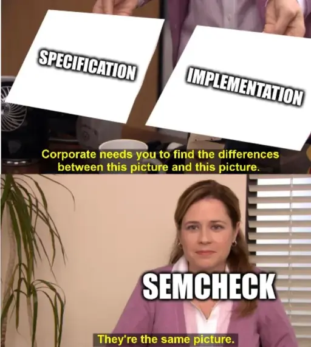

# Semcheck

A Go-based tool for semantic checking of code implementations against specifications using large language models.

## Overview

Semcheck validates that your code implementations match their specifications by leveraging large language models. It integrates seamlessly with pre-commit hooks to validate staged files and ensures your code adheres to documented requirements.

## Installation

### Prerequisites

- Go 1.24 or later
- [Just](https://github.com/casey/just) (optional, for development)

### Install

```bash
go install github.com/rejot-dev/semcheck/cmd/root@latest
```

## Configuration

Create a `semcheck.yaml` configuration file:

```yaml
version: "1.0"
provider: openai
model: gpt-4
api_key: ${OPENAI_API_KEY}
timeout: 30
max_retries: 3
fail_on_issues: true

rules:
  - name: function-spec-compliance
    description: Check if functions match their specifications
    enabled: true
    files:
      include:
        - "**/*.go"
      exclude:
        - "*_test.go"
    specs:
      - path: "docs/api.md"
    severity: "error"
    confidence_threshold: 0.8
```

## Usage

### Basic Usage

**Note:** A configuration file ( by default named `semcheck.yaml`) is required for the tool to function. See the [Configuration](#configuration) section above for setup instructions.

```bash
# Check specific files
semcheck file1.go file2.go

# Use custom config
semcheck -config my-config.yaml file1.go

# Show help
semcheck -help
```

### Development

This project includes a [Justfile](./Justfile) for starting common development tasks.

```bash
# Show available commands
just
```

### Running Tests

```bash
just test
just test-coverage
```

### Check self

Semcheck has its own semcheck configuration, use the `dogfood` task in the Justfile

```bash
just dogfood
```

## Ideal Situation


